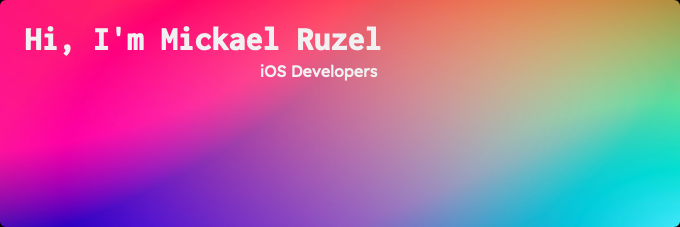
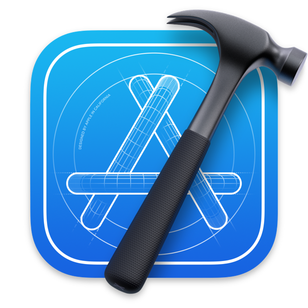
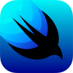
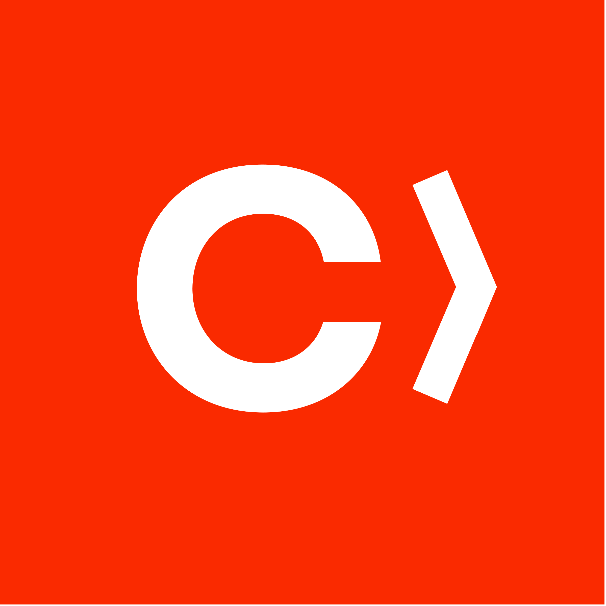

# 👋 Hello There!!! 👋 

    
    

    
    
    

## Let me introduce myself
***

Hi, my name is Mickael, I'm iOS Developer and musicien from France. 
I became developer after a training at "OpenClassRooms". But let me start from the beginning...

I'm originaly professional musician, bassist to be more precise. 
I started music when I was 8 or 9 years old with guitar.
Some years later, I discovered bass, it was a revelation.
After my professional baccalaureate, I decided to live off my passion. 
But I had never learned music.
I just knew which sqaure I had to press... but I did it! In my bedroom, alone with my computer, I learned music theory, 
and in less than a year, I learned to read, write, transcribe, etc, 
and I made my dream come true!

**_"Ok guys but we're on github not some musicians forum"_**

I have always had 3 passions: music, motorcycles and computers.
My degree was about this last, Electronic and Digital System.

I started my trainning with the same will as for music and I got my diploma!!
At this point, I'm looking for a job and while waiting to find, I continue to learn again and again, more framework, good practice, design patern, etc...   

## Skills
***

### Tools

&nbsp;&nbsp;&nbsp;&nbsp;
&nbsp;&nbsp;&nbsp;&nbsp;
&nbsp;&nbsp;&nbsp;&nbsp;
&nbsp;&nbsp;&nbsp;&nbsp;

### Linguages

&nbsp;&nbsp;&nbsp;&nbsp;

### FrameWorks

&nbsp;&nbsp;&nbsp;&nbsp;
&nbsp;&nbsp;&nbsp;&nbsp;
&nbsp;&nbsp;&nbsp;&nbsp;
